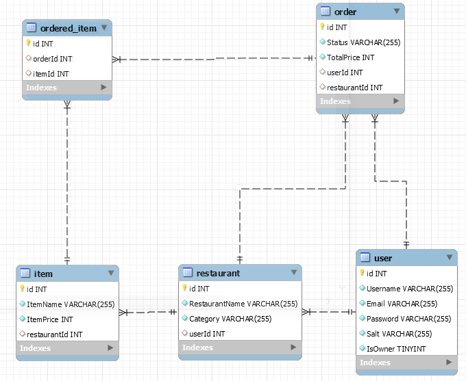

# Food Delivery System ⭐⭐⭐


Table of Contents
=================
   # Algorithms and Datastructures Made Easy ⭐
   ## Topics to Study
   ### Algorithms
   * [Deployment](#Deployment)
   * [Tech Stack](#Tech-Stack)
   * [Backend]()
        * [Architicture](#Architecture)
        * [Database](#Database)
   * [Authentication](#Authentication)
   * [Authorization](#Authorization)
   
# Deployment
Open project directory and type 
```
$ docker compose up -d
```
or open Backend folder in another terminal and type
```
$ npm install 
$ npm run start
```
and open Frontend folder in a terminal and type
```
$ npm install
$ ng serve
```  
Then go to http://localhost:4200


# Tech Stack
## Frontend
* Angular
* SCSS
## Backend
* NestJs
* TypeORM
* MySQL
* phpmyadmin (Deployment)
---
# Backend
## Architecture
The project is built on the repository pattern
## Database

# Authentication
First the user registers as Owner or Client to the system then he will be provided by a JWT bearer token on every request he sends.
# Authorization
After authenticating the user he will be checked on every request either if he can/not do the specified request.
# Made with :heart: __    <a href = "https://www.linkedin.com/in/mohamed-akram-16155b1a3/">Mohamed Akram</a>
